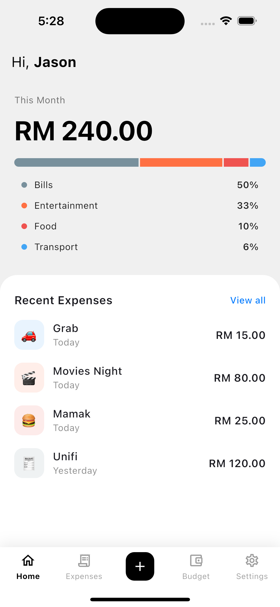
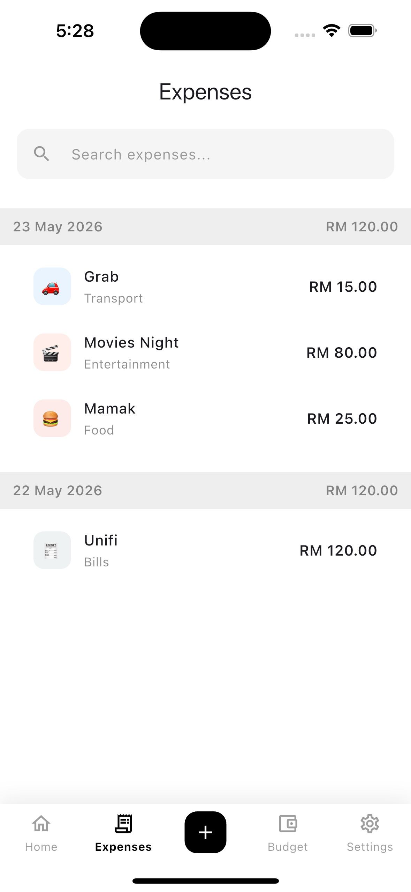
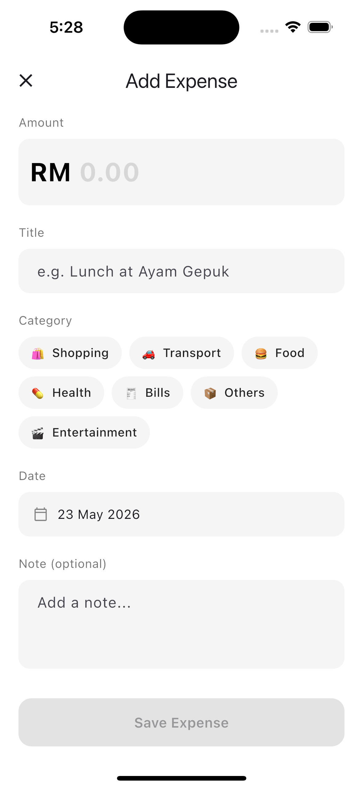
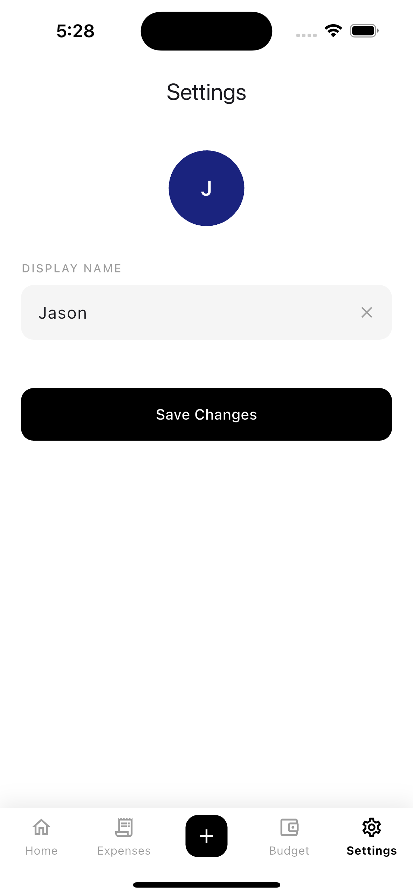

# Personal Expense Tracker

A Flutter app for tracking personal expenses. The app lets users log expenses by category, view a monthly spending summary, and manage their data entirely on-device — no backend required.

---

## Features

- Log expenses with a title, amount, category, date, and optional note
- Edit or delete any existing expense
- Dashboard with total monthly spending and a visual category breakdown
- Category management with colour-coded labels and emoji icons
- Search and filter through all recorded expenses
- Persists all data locally using Hive (no internet connection needed)
- Personalise the app with a display name in Settings

---

## Tech Stack

| Concern | Choice |
|---|---|
| Framework | Flutter (Dart SDK ^3.9.2) |
| State management | Riverpod 2 (`NotifierProvider`) |
| Navigation | GoRouter 14 |
| Local storage | Hive 2 + hive_flutter |
| Architecture | Feature-first MVVM + Repository |

---

## Architecture

The project follows a feature-first folder structure. Each feature owns its own `model/`, `view/`, `viewmodel/`, and `repository/` layers.

```
lib/
  app/              # Router, theme, bottom nav bar
  features/
    dashboard/      # Monthly summary, category breakdown, recent expenses
    expenses/       # Add, edit, delete, search expenses
    budget/         # Category management
    settings/       # User preferences
  shared/           # Reusable widgets
```

State is managed by Riverpod `Notifier` classes. ViewModels hold business logic, repositories handle all Hive reads and writes, and views are kept as thin as possible.

---

## Screenshots

<p float="left">
  
  
  
  
</p>

---

## Getting Started

**Prerequisites:** Flutter 3.x with Dart SDK 3.9.2 or higher.

```bash
# Install dependencies
flutter pub get

# Run code generation (Hive adapters)
dart run build_runner build --delete-conflicting-outputs

# Run the app
flutter run
```

---

## Design Decisions

**Hive over SQLite** — for a single-user expense tracker the schema is simple enough that a key-value store works well, and Hive avoids the need for any native platform dependencies.

**Riverpod `Notifier` over `StateNotifier`** — `Notifier` is the current Riverpod recommendation and gives cleaner access to `ref` inside the class without constructor injection.

**`ExpenseFormScreen` shared between Add and Edit** — rather than maintaining two nearly-identical forms, a single screen accepts an optional `Expense` parameter. When it's null the screen is in "add" mode; when it's provided it's in "edit" mode with a delete option.

**GoRouter `ShellRoute`** — the persistent bottom navigation bar is implemented as a shell so tab switching doesn't rebuild the scaffold on every navigation.
